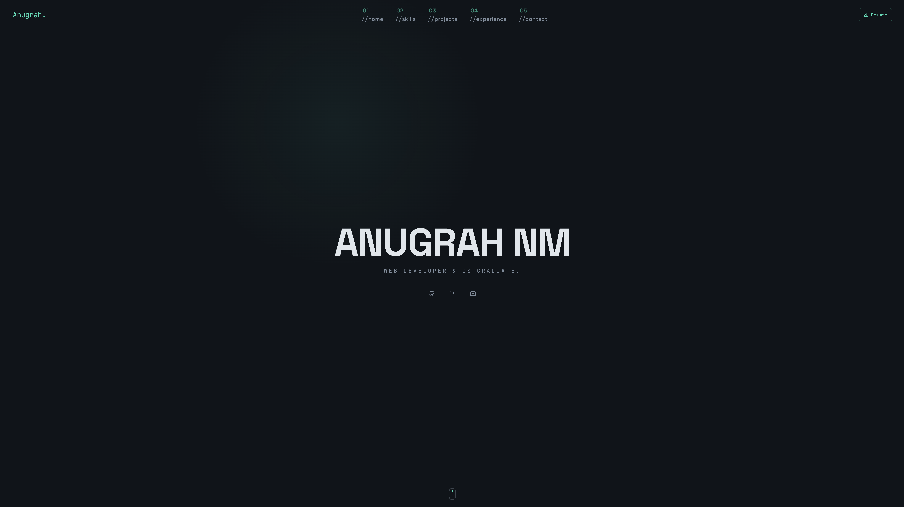

# Portfolio

[anugrah.dev](https://anugrah.dev)

Source code for my personal portfolio. Built with a focus on performance, clean typography, and responsive design.

## Tech Stack

- **Framework:** Next.js 16 (App Router)
- **Language:** TypeScript
- **Styling:** Tailwind CSS
- **Deployment:** Vercel
- **DNS/Security:** Cloudflare (Proxied)

## Technical Implementations

- **Rendering:** Utilizing Next.js Server Components to minimize client-side JavaScript.
- **Assets:** Optimized font loading and image handling via `next/font` and `next/image`.
- **Infrastructure:** Configured with Cloudflare for edge caching and SSL termination to ensure global availability and security.
